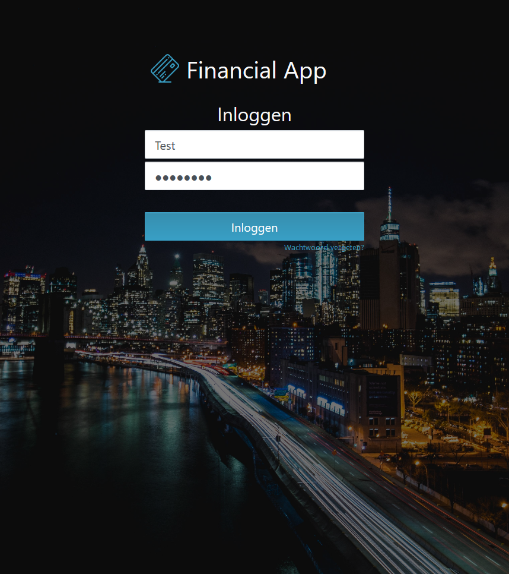
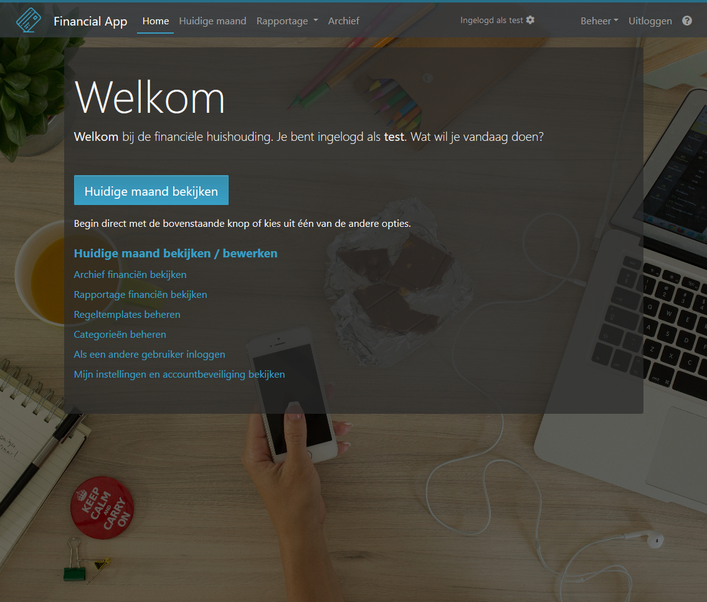
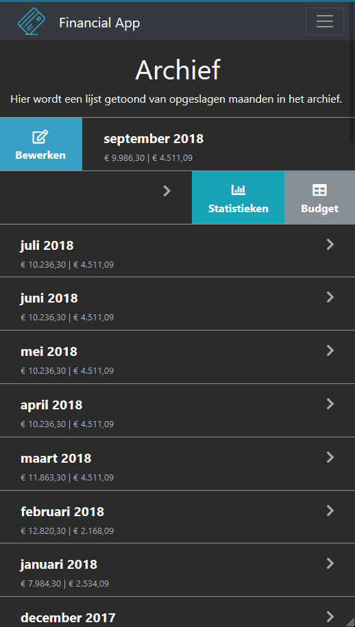
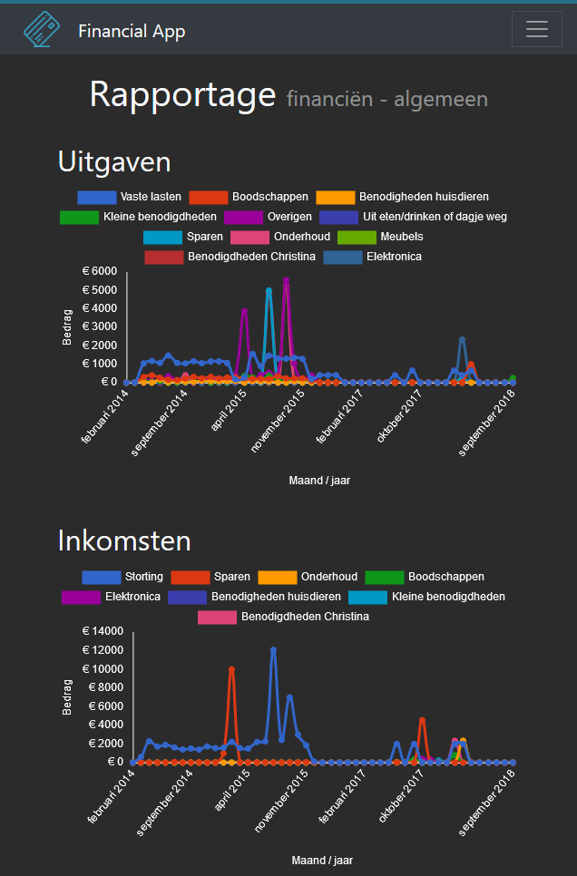

# Financial App

Financial management progressive web application meant for households created using ASP.NET Core, Knockout.js and Entity Framework. Installable as a web app on mobile devices.

Licensed: GNU GPL v3.0

### Features

-   Manage your financial data on month-by-month basis;
-   Split your financial data in different categories;
-   Prediction of monthly balance;
-   Monthly digest via e-mail;
-   Follows security best practices, includes two-factor authentication;
-   Statistics and analysis;
-   Responsive: Works very well on both computer, tablet and mobile phone.

### Browser Support

Developed and tested on:

-   Internet Explorer 11
-   Microsoft Edge
-   Google Chrome
-   Mozilla Firefox
-   Safari (iOS)

## Download and installation

Download a release from the [releases](https://github.com/Sebazzz/financial-app/releases) tab and [follow the installation instructions](docs/Installation.md) in the documentation.

### Cutting-edge builds

Current-edge builds are available from AppVeyor:

-   [Windows 10 / Windows Server 2016 (x64)](https://ci.appveyor.com/api/projects/Sebazzz/financial-app/artifacts/financial-app-win10-x64.zip)
-   [Ubuntu 16.10 (x64)](https://ci.appveyor.com/api/projects/Sebazzz/financial-app/artifacts/financial-app-ubuntu.16.10-x64.tar.gz)
-   [Ubuntu 18.04 (x64)](https://ci.appveyor.com/api/projects/Sebazzz/financial-app/artifacts/financial-app-ubuntu.18.04-x64.tar.gz)

## Building Financial App from sources

If you prefer to build the application yourself, please follow the [compilation instructions](docs/Building-from-sources.md) in the documentation.

## Issues

You can report bugs and improvements on this project. In case of any crashes, please submit the application logs in a Github Gist.

## Screenshots

### **Login**

### **Welcome**

### **Archive (mobile)**

### **Report - general report**

## Contributions

Contributions are allowed and encouraged. Please submit an issue to communicate in advance to prevent disappointments.

## Attribution

Built on:

-   [Knockout.js](http://knockoutjs.com/) for _data binding_;
-   [Bootstrap 4](http://getbootstrap.com/) as _layout framework_;
-   [Fontawesome](http://fontawesome.io/) as _icon framework_;
-   [ASP.NET Core 2.1](https://dot.net) with [Entity Framework Core](https://docs.microsoft.com/en-us/ef/core/) for _server side logic and data persistence_;
-   [router5](http://router5.github.io/) for _routing_.

Built with:

-   [Typescript](https://www.typescriptlang.org/) for _statically typed scripting_;
-   [Webpack](https://webpack.js.org/) for _bundling and asset management_.

Application icon:

Icon made by [Freepik](http://www.freepik.com/) from [www.flaticon.com](http://www.flaticon.com/).
